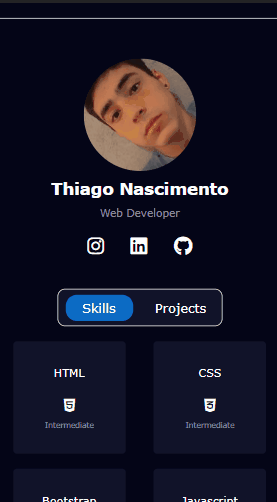
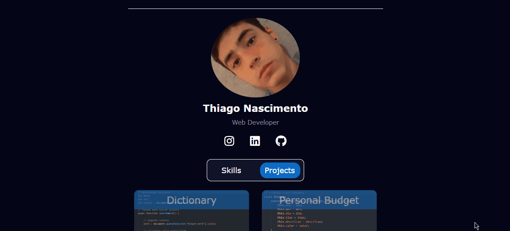

<h1 style='font-size: 40px'>Portfólio</h1>

In this project I developed a portfolio for myself, with it it is possible to access my main projects hosted here on github, in addition to informing about my skills and having access to my other social networks

- Design inspiration: <a href="https://github.com/brenimsilva">@brenimsilva</a>
 

mobile version

desktop version

<h2 style='font-size: 25px'>the following technologies were used for the development of the application:</h2>

- HTML5

- CSS3

- Javascript
